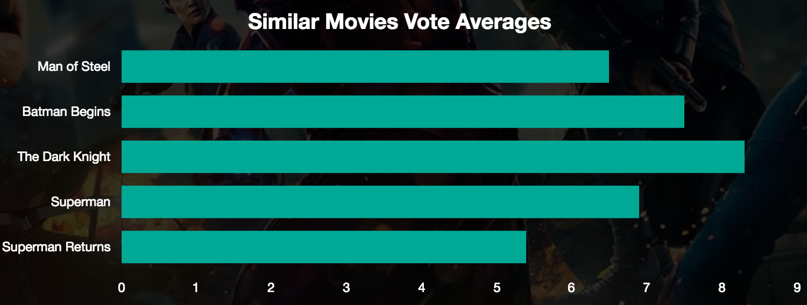

<h1>Movie Data</h1>

<a href="https://arbitrator-hamster-48873.netlify.com/">Movie Data</a> is a responsive full stack app that allows users to search for movies and analyze fun movie data. 

<h2>Motivation</h2>

The main focus of the app is to allow users to search for movies and see the data clearly. Users can also add a movie to their watchlist to keep track of must see movies.

<h2>Features</h2>

Main features of the app are the charts and user scores for each movie. Users can compare similar movie averages in a horizontal chart based on keywords and genres from The Movie DB.

Users can also see the revenue and budget per movie in a bar chart to see how the movie performed in the box office.

<h2> Tech/framework used </h2>
<h3>Front End</h3>

<ul>
  <li>HTML</li>
  <li>CSS</li>
  <li>JavaScript</li>
  <li>React</li>
  <li>Redux</li>
  <li><a href="http://www.chartjs.org/">Chart.js</a></li>
  <li>React Circular Progressbar </li>
</ul>

<h3>Back End</h3>
<ul>
  <li>Node.js + Express.js (web server)</li>
  <li>MongoDB (database)</li>
  <li><a href="https://mochajs.org/">Mocha</a> + <a href="http://chaijs.com/">Chai</a> (testing)</li>
  <li>Continuous integration and deployment with <a href="https://travis-ci.org/">Travis CI</a></li>
</ul>

<h3>Security</h3>
<ul>
  <li>User passwords are encrypted using <a href="https://github.com/dcodeIO/bcrypt.js">bcrypt.js</a>.</li>
  <li><a href="https://jwt.io/">JWT</a> is used to authenticate users.</li>
</ul>
